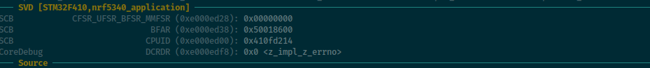

# gdb-dashboard SVD module

## Description

A [gdb-dashboard](https://github.com/cyrus-and/gdb-dashboard) module to display SVD registers.


Unlike other projects, this one adds the ability to load several SVD files at once. Most of the time, vendors' SVD file does not contain ARM base registers that are useful for debugging : SCB CFSR for example.

Here's the [Nordic nRF5340 svd file](https://raw.githubusercontent.com/NordicSemiconductor/nrfx/master/mdk/nrf5340_application.svd) and you can see that the System Control Block is not present. To address this, just use the SVD from Nordic and the Cortex-M33 SVD form ARM at the same time.

## Installation

This project depends on [cmsis-svd](https://github.com/cmsis-svd/cmsis-svd) and requires at least gdb-dashboard version 0.17.
```
$ pip3 install -r ./requirements.txt
```

Then simply add gdb-dashboad-svd.py in your ~/.gdbinit.d/ directory.

## Usage

All commands benefit from a useful completion.

### Add some SVD files

```
dashboard svd load ./Cortex-M33.svd ./nrf5340_application.svd
```

### Add some registers to display

```
dashboard svd /_t add SCB CFSR
dashboard svd /a add SCB BFAR
```

The display format depends on the option:
- a for address
- u for decimal
- x for hexadecimal
- t for binary
- _t for binary with separator

### Remove some registers

```
dashboard svd remove SCB CFSR_UFSR_BFSR_MMFSR
dashboard svd remove SCB BFAR
```

### Clear all registers

```
dashboard svd clear
```

## Standalone commmands

This module also creates three gdb commands:
* ```svd info [<peripheral> [<register>]]```
* ```svd get [/auxt_t] <peripheral> <register>```
* ```svd search <start_address> [<end_address>]```

Example:
```
>>> svd info SCB HFSR
HFSR addr: 0xe000ed2c (access: SVDAccessType.READ_WRITE, desc: HFSR)
	DEBUGEVT        [31] (DEBUGEVT)
	FORCED          [30] (Forced)
	VECTTBL         [1] (VECTTBL)
>>> svd get /_t SCB HFSR
0xe000ed2c:     0b0000_0000_0000_0000_0000_0000_0000_0000
>>> svd search 0xe000ed08 0xe000ed08+0x10
0xe000ed0c: SCB AIRCR_S
0xe000ed0c: SCB AIRCR_NS
0xe000ed0c: SCB AIRCR
0xe000ed14: SCB CCR_S
0xe000ed14: SCB CCR_NS
0xe000ed14: SCB CCR
0xe000ed18: SCB SHPR1_S
0xe000ed18: SCB SHPR1_NS
0xe000ed18: SCB SHPR1
0xe000ed08: SCB VTOR_S
0xe000ed08: SCB VTOR_NS
0xe000ed08: SCB VTOR
```
